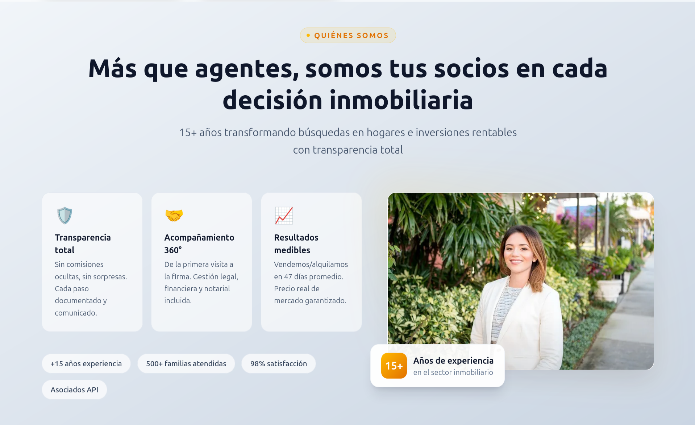
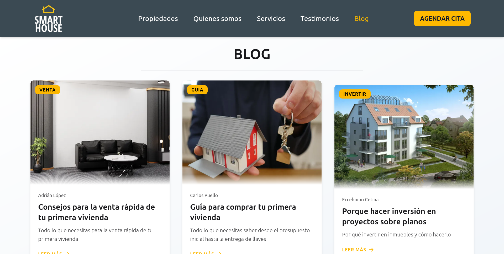

# Smart House - Landing Page Inmobiliaria

Landing page para una empresa de inmobiliaria en Barranquilla, Colombia. Permite a los clientes encontrar apartamentos disponibles, leer artículos del blog y contactar al equipo de ventas.





## 🚀 Stack Tecnológico

| Categoría | Tecnología | Función |
|-----------|------------|---------|
| **Framework** | [Astro 5](https://astro.build/) | Generación de sitios estáticos con SSG |
| **Integración** | [@astrojs/react](https://docs.astro.build/es/guides/integrations-guide/react/) | Hydratación de componentes React en Astro |
| **UI (React)** | [React 19](https://react.dev/) + [ReactDOM](https://react.dev/) | Componentes interactivos (formulario de contacto) |
| **Estilos** | [Tailwind CSS 4](https://tailwindcss.com/) | Utility-first CSS con plugin Vite |
| **Componentes UI** | [DaisyUI 5](https://daisyui.com/) | Componentes preestilizados (cards, badges, ratings) |
| **Tipografía** | [@tailwindcss/typography](https://tailwindcss.com/docs/typography-plugin) | Clases `prose` para contenido Markdown |
| **Formularios** | [React Hook Form 7](https://react-hook-form.com/) | Gestión de estado y validación de formularios |
| **Validación** | [Zod](https://zod.dev/) (vía [@hookform/resolvers](https://react-hook-form.com/)) | Schemas de validación con tipado TypeScript |
| **Iconos** | [React Icons 5](https://react-icons.github.io/react-icons/) | Iconos de múltiples librerías (Font Awesome, Heroicons, etc.) |
| **Notificaciones** | [React Toastify 11](https://fkhadra.github.io/react-toastify/) | Toasts de confirmación en el formulario |
| **HTTP Client** | [Axios 1](https://axios-http.com/) | Consumo de API externa (testimonios de dummyjson) |
| **Animaciones** | [AOS 2](https://michalsnik.github.io/aos/) | Animaciones al hacer scroll |
| **Imágenes** | [Sharp 0.34](https://sharp.pixelplumbing.com/) | Optimización de imágenes en build |
| **TypeScript** | [@types/react](https://www.typescriptlang.org/) + [@types/react-dom](https://www.typescriptlang.org/) | Tipado estático |

## 📁 Estructura del Proyecto

```
src/
├── components/
│   ├── Home/              # Header y Footer
│   ├── Layout/            # Secciones: Hero, Propiedades, Servicios, Blog, Contacto
│   ├── Shared/            # Cards reutilizables (Propiedad, Testimonial, Blog, Servicio)
│   └── Blog/              # Barra de progreso, botón volver arriba, posts relacionados
├── content/
│   ├── inmuebles/         # 6 apartamentos (Markdown con frontmatter Zod)
│   └── blog/              # 3 artículos del blog
├── data/                  # Datos: navegación, testimonios, servicios
├── layouts/               # Layout maestro (Header, Footer, AOS, View Transitions)
├── pages/                 # Rutas: index, blog/[...id], inmuebles/[...slug]
├── schemas/               # Schemas Zod (nav, testimonios, servicios, contacto)
├── types/                 # Tipos TypeScript derivados de Zod
├── utils/                 # Utilidades (formateo de pesos colombianos)
├── assets/                # Logo, SVGs
├── img/                   # Imágenes del proyecto
└── styles/                # Estilos globales (Tailwind + DaisyUI)
```

## ⚡ Características Técnicas

- **Content Collections**: Propiedades y blog gestionados con schemas Zod, validados en build time
- **View Transitions**: Navegación tipo SPA con `<ClientRouter />` de Astro
- **Scroll Spy**: Navegación con IntersectionObserver que resalta la sección activa
- **Hybrid Rendering**: Astro (SSG) para la mayoría de componentes + React (client:idle) solo para el formulario
- **Optimización de Imágenes**: `getImage()` + `<link rel="preload">` para carga progresiva
- **Formulario Validado**: React Hook Form + Zod con mensajes de error en español
- **Formato de Moneda**: `Intl.NumberFormat` para pesos colombianos (COP)
- **Reduced Motion**: AOS respeta la preferencia de movimiento del usuario
- **Blog con Metadata**: Barra de progreso de lectura, posts relacionados por tags, volver arriba

## 📝 Instrucciones

1. Clonar el repositorio
2. Instalar dependencias con `pnpm install`
3. Iniciar el servidor con `pnpm run dev`
4. Acceder a la página en `http://localhost:4321`

## 📄 Licencia

Este proyecto está bajo la licencia MIT. Para más información, consulte el archivo [LICENSE](./LICENSE).

## 📜 Autor

[Carlos Puello](https://github.com/capb1987)

## 🔗 Enlaces

- **Página web desplegada**: https://realstatewebpackcapb.netlify.app/
